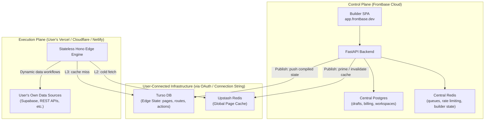
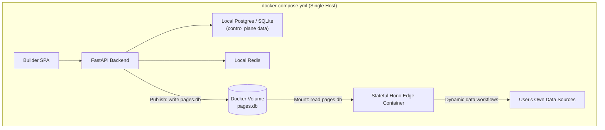
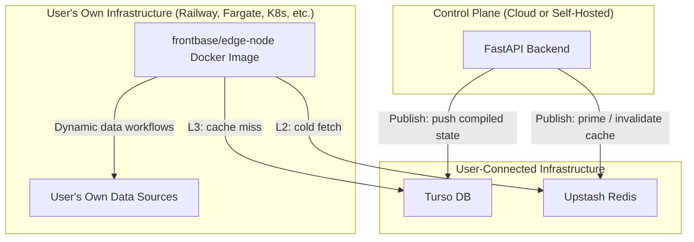
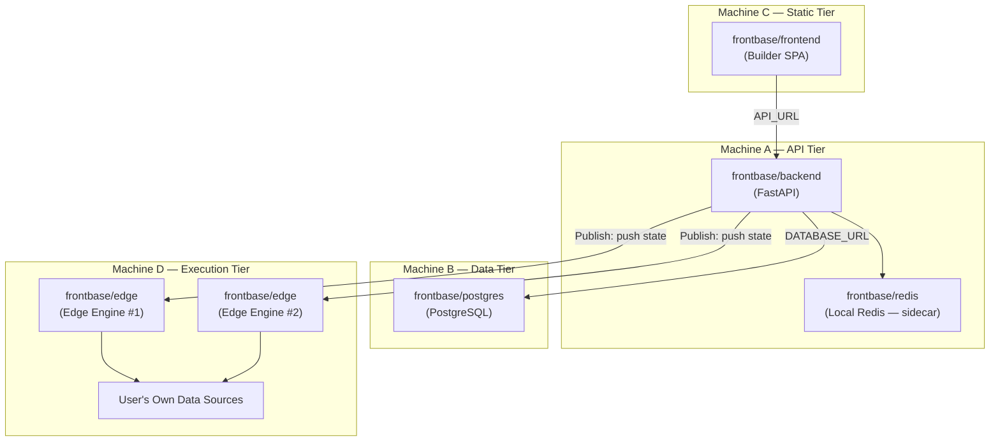

# Frontbase Edge Architecture

This document defines the strategic deployment architecture for the Frontbase Edge Engine (`services/edge`). A single Hono-based codebase supports four distinct deployment modes: **Cloud (BYOE)**, **Self-Hosted (All-in-One)**, **Standalone Edge Node**, and **Distributed Self-Hosted**.

---

## Core Philosophy

The architecture separates two distinct planes:

- **Control Plane:** Where users *build* their apps (FastAPI, Builder SPA, Central Postgres).
- **Execution Plane:** Where visitors *access* the published apps (Hono Edge Engine + Edge State DB + Cache).

Frontbase acts as the **orchestration layer** only. It does not provision or manage infrastructure on the user's behalf. Instead, it guides users through a one-click OAuth/connection-string setup to connect their own Turso and Upstash accounts. The FastAPI backend then orchestrates publishing operations across these user-connected services.

---

## Architecture Diagrams

### 1. Cloud (SaaS) — Bring Your Own Edge (BYOE)



### 2. Self-Hosted — All-in-One Docker



### 3. Standalone Edge Node



---

## 1. Cloud (SaaS) Deployment: BYOE Model

Targeted at SaaS customers wanting infinite scalability with zero self-managed infrastructure.

### Control Plane (Frontbase Managed)
- **Builder SPA:** `app.frontbase.dev` (React/Vite).
- **FastAPI Backend:** Handles auth, project CRUD, and orchestrates the publish pipeline.
- **Central Postgres:** Source of truth for all draft builder state (users, workspaces, projects, billing).
- **Central Redis:** Backend task queues, rate limiting, live builder session state.

### User-Connected Infrastructure
These services are provisioned and owned by the user. Frontbase provides a one-click OAuth or connection string flow to connect them:
- **Turso DB (Source of Truth):** One database per project. The single source of truth for **all** persistent edge state: compiled page layouts, routing trees, Action workflow definitions, compiled CSS bundles, analytics aggregates, automation execution logs, and rate limit rules.
- **Upstash Redis (Cache / Buffer Only):** A globally distributed, fully disposable caching and buffering layer. If the entire Redis cache is flushed, **zero data is lost** — the Edge Engine simply re-populates from Turso on the next request. Used for:
  - Hot page JSON and CSS for instant L2 reads.
  - Buffered analytics counters (`INCR`, periodically flushed to Turso).
  - Buffered automation logs (batch-written to Turso).
  - Ephemeral rate limit state (TTL-based, expendable).
  - Temporary preview links (auto-expiring via TTL).

### Execution Plane (User Managed)
- **Stateless Hono Edge Engine:** Deployed once by the user to their Vercel, Cloudflare, or Netlify account. Never re-deployed on publish.

### Publishing Pipeline (Cloud)
When the user hits **Publish**:
1. FastAPI compiles the raw canvas state from Postgres into an optimized routing tree and JSON component/action definitions.
2. FastAPI pushes compiled SQL `INSERT/UPDATE` statements to the user's **Turso DB** via `@libsql/client` over HTTP.
3. FastAPI invalidates or primes the relevant keys in the user's **Upstash Redis**.

### Request Lifecycle (Cloud)
1. Visitor hits `www.user-site.com` (routes to their Vercel/Cloudflare Edge Function).
2. **L1 Local RAM:** Edge Engine checks in-process memory (SWR ~60s). Serves instantly if warm.
3. **L2 Upstash Redis:** Fetches compiled JSON page blueprint via HTTP (<10ms).
4. **L3 Turso DB:** On full cache miss, queries the geographically nearest Turso replica via HTTP using `@libsql/client` (~5ms).
5. **Dynamic Data:** Edge Engine executes Action workflows against the user's own data sources (Supabase, REST APIs, etc.).
6. Renders and serves final HTML. Caches result in L1 and L2.

---

## 2. Self-Hosted Deployment: All-In-One Model

Targeted at privacy-focused enterprises, internal tool builders, and hobbyists. Everything runs via `docker-compose.yml`.

### Architecture
- **Control Plane:** Builder SPA + FastAPI + Local Postgres/SQLite + Local Redis.
- **Execution Plane:** Stateful Hono Edge Container, mounted to a shared Docker volume containing `pages.db`.

### Publishing Pipeline (Self-Hosted)
When the user hits **Publish**:
1. FastAPI compiles the canvas state into the same optimized JSON/SQL structure as in the Cloud.
2. FastAPI writes the compiled output to **`pages.db`** on the shared Docker volume.
3. The Hono Edge Container reads `pages.db` directly from disk — no network calls needed.

### The Adapter Pattern
The Hono Edge Engine codebase is **100% identical** across all modes. On boot, it reads one environment variable to select the correct storage adapter:

| `FRONTBASE_ENV` | Storage Adapter | Connection |
|---|---|---|
| `cloud` | `TursoHttpProvider` | HTTP to `FRONTBASE_STATE_DB_URL` |
| `local` *(default)* | `LocalSqliteProvider` | Local file at `FRONTBASE_LOCAL_DB_PATH` |

The **same adapter pattern applies to FastAPI's publish pipeline**: `PUBLISH_STRATEGY=local` writes to the Docker volume; `PUBLISH_STRATEGY=turso` pushes to the user's Turso DB over HTTP.

---

## 3. Standalone Edge Node

Targeted at advanced users who want to use either the Cloud Builder or their self-hosted Control Plane, but need sovereign compute for their runtime data (compliance, latency, custom K8s).

### Architecture
The `frontbase/edge-node` Docker image contains *only* the stateless Hono Edge Engine. The user deploys it anywhere (Railway, AWS Fargate, DigitalOcean, private Kubernetes).

### Publishing Pipeline (Standalone Node)
The Frontbase Control Plane (Cloud or Self-Hosted) is still the publisher:
1. The user registers their Turso and Upstash connection strings in the Frontbase dashboard.
2. On Publish, FastAPI pushes compiled state to the user's Turso DB and invalidates Upstash.
3. The user's self-managed `frontbase/edge-node` containers automatically serve the updated content on the next request — no redeployment needed.

### Required Environment Variables
```bash
FRONTBASE_ENV=cloud
FRONTBASE_STATE_DB_URL=libsql://project-xyz.turso.io
FRONTBASE_STATE_DB_TOKEN=...
FRONTBASE_REDIS_URL=rediss://...
```

### Why This Is Powerful
A single Frontbase Control Plane can publish to *multiple* Standalone Edge Node clusters simultaneously — for example, a company's EU cluster and US cluster — enabling multi-region sovereign deployments.

---

## 4. Distributed Self-Hosted

Targeted at operators who want the simplicity of self-hosting but need to **split services across separate machines** for performance isolation, compliance, or scaling.

### Core Idea
Every service in the Frontbase stack ships as its own Docker image. The default `docker-compose.yml` runs them all on one host as a convenience, but each image can be deployed independently on separate machines — just override the connection environment variables.

### Architecture Diagram



### Docker Image Strategy

Each service has its own Dockerfile and published image. All images can participate in a single `docker-compose.yml` **or** be deployed standalone:

| Image | Contains | Default Port |
|---|---|---|
| `frontbase/backend` | FastAPI control plane | `8000` |
| `frontbase/frontend` | Builder SPA (Vite/React) | `3000` |
| `frontbase/edge` | Hono Edge Engine | `3001` |
| `frontbase/postgres` | PostgreSQL (standard image) | `5432` |
| `frontbase/redis` | Redis (standard image) | `6379` |

### Natural Grouping Guidance

When splitting across machines, Redis should be co-located with the **Backend**, not Postgres:

| Grouping | Rationale |
|---|---|
| **Backend + Redis** (API Tier) | Backend is the primary Redis consumer (cache invalidation, publish pipeline, rate limits, preview links). Sub-ms latency matters here. |
| **Postgres** (Data Tier) | I/O-bound workload. Benefits from dedicated disk IOPS. No direct Redis dependency. |
| **Frontend SPA** (Static Tier) | Stateless static files. Can be served from a CDN or any web server. |
| **Edge Engine(s)** (Execution Tier) | Stateless workers. Scale independently. Connect to data stores via env vars. |

### Environment Variable Contract

Each service discovers its dependencies via environment variables. When all services run in docker-compose, these resolve to internal container names. When split across machines, override them with the remote host/URL:

```bash
# --- Backend (frontbase/backend) ---
DATABASE_URL=postgresql://user:pass@<postgres-host>:5432/frontbase
REDIS_URL=redis://<redis-host>:6379
EDGE_ENGINE_URL=https://<edge-host>:3001

# --- Frontend (frontbase/frontend) ---
API_URL=https://<backend-host>:8000

# --- Edge Engine (frontbase/edge) ---
FRONTBASE_ENV=local          # or 'cloud' for Turso/Upstash mode
FRONTBASE_LOCAL_DB_PATH=/data/pages.db   # if local mode with volume
FRONTBASE_STATE_DB_URL=libsql://...      # if cloud mode
FRONTBASE_REDIS_URL=redis://<redis-host>:6379
```

### Security Considerations
When services communicate across machines (vs. the docker-compose internal network), you must:
- **Use TLS** for all inter-service connections (Postgres `sslmode=require`, `rediss://`, HTTPS for APIs).
- **Firewall** service ports to only accept traffic from known peer machines.
- **Use secrets management** (Docker Secrets, Vault, cloud KMS) instead of plaintext env vars in production.

---

## Data Responsibility Matrix

| Data Type | Source of Truth (Turso) | Cache / Buffer (Upstash Redis) |
|---|---|---|
| Page layouts & routing trees | ✅ Persistent storage | ✅ Hot JSON cache (L2) |
| Compiled CSS bundles | ✅ Persistent storage | ✅ Cached strings for fast delivery |
| Action/automation definitions | ✅ Persistent storage | — |
| Automation execution logs | ✅ Persistent storage | ✅ Buffered writes (batch flush) |
| Analytics data | ✅ Persistent aggregates | ✅ Buffered counters (periodic flush) |
| Rate limit rules | ✅ Persistent rule config | ✅ Ephemeral active state (TTL-based) |
| Preview links | — | ✅ Temporary keys (auto-expire via TTL) |

> **Golden Rule:** Writes always persist to Turso (directly or via Redis buffer flush). Reads always try Redis first, fall back to Turso on cache miss. Redis is 100% disposable.

> [!NOTE]
> **Future Vision:** Upstash Redis will expand beyond caching into a **workflow dispatch and message queue** role. As the automation/workflow engine matures, Redis will act as the broker that pushes and schedules Action executions to edge workers (Cloudflare Workers, Supabase Edge Functions, etc.), enabling globally distributed, event-driven automation pipelines.

---

## Decision Log

| Decision | Rationale |
|---|---|
| Turso for Edge State DB (Phase 1) | Globally distributed libSQL replicas, HTTP driver works on Cloudflare/Vercel, per-tenant DB isolation is trivially cheap. |
| Neon (Postgres) for Edge State DB (Phase 2) | Planned for users requiring advanced Postgres features (JSONB, pgvector, RLS). Single-region unless using paid read replicas. |
| Upstash as Cache/Buffer Only | Fully Redis-compatible, serverless HTTP driver, globally distributed. Fully disposable — zero data loss on flush. |
| Hono for Edge Engine | First-class support for Cloudflare Workers, Vercel Edge, Node.js, and Bun out of the box. |
| User-Connected Infrastructure | Frontbase is not a managed infra provider. Turso/Upstash are user-owned. Frontbase is an orchestration layer only. |
