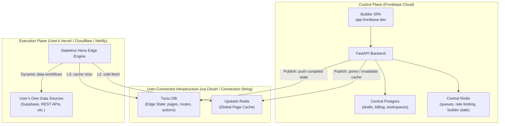
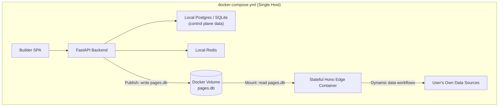
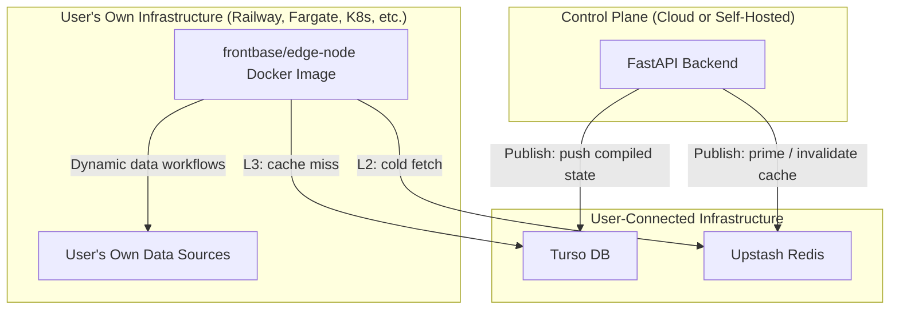
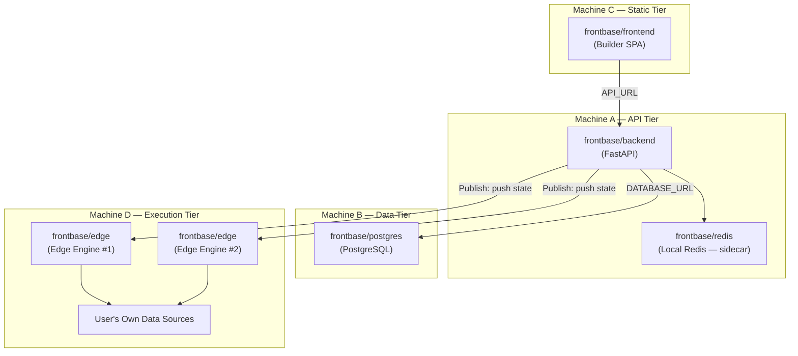
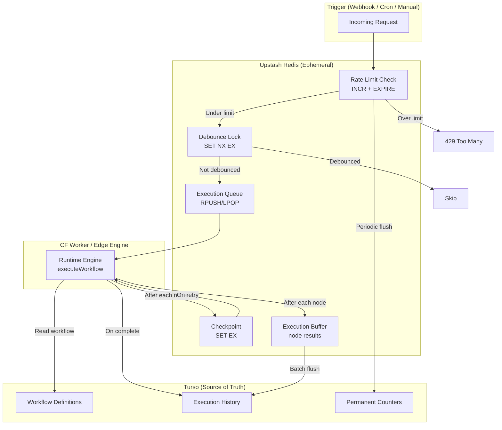

# Frontbase Edge Architecture

> Last Updated: 2026-03-01

This document defines the strategic deployment architecture for the Frontbase Edge Engine (`services/edge`). A single Hono-based codebase supports four distinct deployment modes: **Cloud (BYOE)**, **Self-Hosted (All-in-One)**, **Standalone Edge Node**, and **Distributed Self-Hosted**.

---

## Core Philosophy

The architecture separates two distinct planes:

- **Control Plane:** Where users *build* their apps (FastAPI, Builder SPA, Central Postgres).
- **Execution Plane:** Where visitors *access* the published apps (Hono Edge Engine + Edge State DB + Cache).

Frontbase acts as the **orchestration layer** only. It does not provision or manage infrastructure on the user's behalf. Instead, it guides users through a one-click OAuth/connection-string setup to connect their own Turso and Upstash accounts. The FastAPI backend then orchestrates publishing operations across these user-connected services.

---

## Architecture Diagrams

### 1. Cloud (SaaS) — Bring Your Own Edge (BYOE)


```mermaid
flowchart TD
    subgraph Control["Control Plane (Frontbase Cloud)"]
        SPA["Builder SPA\napp.frontbase.dev"]
        API["FastAPI Backend"]
        PG["Central Postgres\n(drafts, billing, workspaces)"]
        Redis["Central Redis\n(queues, rate limiting, builder state)"]
    end

    subgraph UserInfra["User-Connected Infrastructure (via OAuth / Connection String)"]
        Turso["Turso DB\n(Edge State: pages, routes, actions)"]
        Upstash["Upstash Redis\n(Global Page Cache)"]
    end

    subgraph Execution["Execution Plane (User's Vercel / Cloudflare / Netlify)"]
        Edge["Stateless Hono Edge Engine"]
        UserDS["User's Own Data Sources\n(Supabase, REST APIs, etc.)"]
    end

    SPA --> API
    API --> PG
    API --> Redis
    API -- "Publish: push compiled state" --> Turso
    API -- "Publish: prime / invalidate cache" --> Upstash
    Edge -- "L2: cold fetch" --> Upstash
    Edge -- "L3: cache miss" --> Turso
    Edge -- "Dynamic data workflows" --> UserDS
```

### 2. Self-Hosted — All-in-One Docker


```mermaid
flowchart TD
    subgraph Docker["docker-compose.yml (Single Host)"]
        SPA["Builder SPA"]
        API["FastAPI Backend"]
        PG["Local Postgres / SQLite\n(control plane data)"]
        Redis["Local Redis"]
        Vol[("Docker Volume\npages.db")]
        Edge["Stateful Hono Edge Container"]
        UserDS["User's Own Data Sources"]
    end

    SPA --> API
    API --> PG
    API --> Redis
    API -- "Publish: write pages.db" --> Vol
    Vol -- "Mount: read pages.db" --> Edge
    Edge -- "Dynamic data workflows" --> UserDS
```

### 3. Standalone Edge Node


```mermaid
flowchart TD
    subgraph ControlAny["Control Plane (Cloud or Self-Hosted)"]
        API["FastAPI Backend"]
    end

    subgraph UserInfra["User-Connected Infrastructure"]
        Turso["Turso DB"]
        Upstash["Upstash Redis"]
    end

    subgraph UserHost["User's Own Infrastructure (Railway, Fargate, K8s, etc.)"]
        Edge["frontbase/edge-node Docker Image"]
        UserDS["User's Own Data Sources"]
    end

    API -- "Publish: push compiled state" --> Turso
    API -- "Publish: prime / invalidate cache" --> Upstash
    Edge -- "L2: cold fetch" --> Upstash
    Edge -- "L3: cache miss" --> Turso
    Edge -- "Dynamic data workflows" --> UserDS
```

---

## 1. Cloud (SaaS) Deployment: BYOE Model

Targeted at SaaS customers wanting infinite scalability with zero self-managed infrastructure.

### Control Plane (Frontbase Managed)
- **Builder SPA:** `app.frontbase.dev` (React/Vite).
- **FastAPI Backend:** Handles auth, project CRUD, and orchestrates the publish pipeline.
- **Central Postgres:** Source of truth for all draft builder state (users, workspaces, projects, billing).
- **Central Redis:** Backend task queues, rate limiting, live builder session state.

### User-Connected Infrastructure
These services are provisioned and owned by the user. Frontbase provides a one-click OAuth or connection string flow to connect them:
- **Turso DB (Source of Truth):** One database per project. The single source of truth for **all** persistent edge state: compiled page layouts, routing trees, Action workflow definitions, compiled CSS bundles, analytics aggregates, automation execution logs, and rate limit rules.
- **Upstash Redis (Cache / Buffer Only):** A globally distributed, fully disposable caching and buffering layer. If the entire Redis cache is flushed, **zero data is lost** — the Edge Engine simply re-populates from Turso on the next request. Used for:
  - Hot page JSON and CSS for instant L2 reads.
  - Buffered analytics counters (`INCR`, periodically flushed to Turso).
  - Buffered automation logs (batch-written to Turso).
  - Ephemeral rate limit state (TTL-based, expendable).
  - Temporary preview links (auto-expiring via TTL).

### Execution Plane (User Managed)
- **Stateless Hono Edge Engine:** Deployed once by the user to their Vercel, Cloudflare, or Netlify account. Never re-deployed on publish.

### Publishing Pipeline (Cloud)
When the user hits **Publish**:
1. FastAPI compiles the raw canvas state from Postgres into an optimized routing tree and JSON component/action definitions.
2. FastAPI pushes compiled SQL `INSERT/UPDATE` statements to the user's **Turso DB** via `@libsql/client` over HTTP.
3. FastAPI invalidates or primes the relevant keys in the user's **Upstash Redis**.

### Request Lifecycle (Cloud)
1. Visitor hits `www.user-site.com` (routes to their Vercel/Cloudflare Edge Function).
2. **L1 Local RAM:** Edge Engine checks in-process memory (SWR ~60s). Serves instantly if warm.
3. **L2 Upstash Redis:** Fetches compiled JSON page blueprint via HTTP (<10ms).
4. **L3 Turso DB:** On full cache miss, queries the geographically nearest Turso replica via HTTP using `@libsql/client` (~5ms).
5. **Dynamic Data:** Edge Engine executes Action workflows against the user's own data sources (Supabase, REST APIs, etc.).
6. Renders and serves final HTML. Caches result in L1 and L2.

---

## 2. Self-Hosted Deployment: All-In-One Model

Targeted at privacy-focused enterprises, internal tool builders, and hobbyists. Everything runs via `docker-compose.yml`.

### Architecture
- **Control Plane:** Builder SPA + FastAPI + Local Postgres/SQLite + Local Redis.
- **Execution Plane:** Stateful Hono Edge Container, mounted to a shared Docker volume containing `pages.db`.

### Publishing Pipeline (Self-Hosted)
When the user hits **Publish**:
1. FastAPI compiles the canvas state into the same optimized JSON/SQL structure as in the Cloud.
2. FastAPI writes the compiled output to **`pages.db`** on the shared Docker volume.
3. The Hono Edge Container reads `pages.db` directly from disk — no network calls needed.

### The Adapter Pattern
The Hono Edge Engine codebase is **100% identical** across all modes. On boot, it reads one environment variable to select the correct storage adapter:

| `FRONTBASE_DEPLOYMENT_MODE` | Storage Adapter | Connection |
|---|---|---|
| `cloud` | `TursoHttpProvider` | HTTP to `FRONTBASE_STATE_DB_URL` + `FRONTBASE_STATE_DB_TOKEN` |
| `local` *(default)* | `LocalSqliteProvider` | Local file at `PAGES_DB_URL` (default: `file:./data/pages.db`) |

The **same adapter pattern applies to FastAPI's publish pipeline**: in self-hosted mode, the backend writes directly to the shared Docker volume; in cloud mode, it pushes to the user's Turso DB over HTTP.

---

## 3. Standalone Edge Node

Targeted at advanced users who want to use either the Cloud Builder or their self-hosted Control Plane, but need sovereign compute for their runtime data (compliance, latency, custom K8s).

### Architecture
The `frontbase/edge-node` Docker image contains *only* the stateless Hono Edge Engine. The user deploys it anywhere (Railway, AWS Fargate, DigitalOcean, private Kubernetes).

### Publishing Pipeline (Standalone Node)
The Frontbase Control Plane (Cloud or Self-Hosted) is still the publisher:
1. The user registers their Turso and Upstash connection strings in the Frontbase dashboard.
2. On Publish, FastAPI pushes compiled state to the user's Turso DB and invalidates Upstash.
3. The user's self-managed `frontbase/edge-node` containers automatically serve the updated content on the next request — no redeployment needed.

### Required Environment Variables
```bash
FRONTBASE_DEPLOYMENT_MODE=cloud
FRONTBASE_STATE_DB_URL=libsql://project-xyz.turso.io
FRONTBASE_STATE_DB_TOKEN=...
UPSTASH_REDIS_REST_URL=https://...
UPSTASH_REDIS_REST_TOKEN=...
```

### Why This Is Powerful
A single Frontbase Control Plane can publish to *multiple* Standalone Edge Node clusters simultaneously — for example, a company's EU cluster and US cluster — enabling multi-region sovereign deployments.

---

## 4. Distributed Self-Hosted

Targeted at operators who want the simplicity of self-hosting but need to **split services across separate machines** for performance isolation, compliance, or scaling.

### Core Idea
Every service in the Frontbase stack ships as its own Docker image. The default `docker-compose.yml` runs them all on one host as a convenience, but each image can be deployed independently on separate machines — just override the connection environment variables.

### Architecture Diagram


```mermaid
flowchart TD
    subgraph TierA["Machine A — API Tier"]
        API["frontbase/backend\n(FastAPI)"]
        Redis["frontbase/redis\n(Local Redis — sidecar)"]
    end

    subgraph TierB["Machine B — Data Tier"]
        PG["frontbase/postgres\n(PostgreSQL)"]
    end

    subgraph TierC["Machine C — Static Tier"]
        SPA["frontbase/frontend\n(Builder SPA)"]
    end

    subgraph TierD["Machine D — Execution Tier"]
        Edge1["frontbase/edge\n(Edge Engine #1)"]
        Edge2["frontbase/edge\n(Edge Engine #2)"]
        UserDS["User's Own Data Sources"]
    end

    API --> Redis
    API -- "DATABASE_URL" --> PG
    SPA -- "API_URL" --> API
    API -- "Publish: push state" --> Edge1
    API -- "Publish: push state" --> Edge2
    Edge1 --> UserDS
    Edge2 --> UserDS
```

### Docker Image Strategy

Each service has its own Dockerfile and published image. All images can participate in a single `docker-compose.yml` **or** be deployed standalone:

| Image | Contains | Default Port |
|---|---|---|
| `frontbase/backend` | FastAPI control plane | `8000` |
| `frontbase/frontend` | Builder SPA (Vite/React) | `3000` |
| `frontbase/edge` | Hono Edge Engine | `3001` |
| `frontbase/postgres` | PostgreSQL (standard image) | `5432` |
| `frontbase/redis` | Redis (standard image) | `6379` |

### Natural Grouping Guidance

When splitting across machines, Redis should be co-located with the **Backend**, not Postgres:

| Grouping | Rationale |
|---|---|
| **Backend + Redis** (API Tier) | Backend is the primary Redis consumer (cache invalidation, publish pipeline, rate limits, preview links). Sub-ms latency matters here. |
| **Postgres** (Data Tier) | I/O-bound workload. Benefits from dedicated disk IOPS. No direct Redis dependency. |
| **Frontend SPA** (Static Tier) | Stateless static files. Can be served from a CDN or any web server. |
| **Edge Engine(s)** (Execution Tier) | Stateless workers. Scale independently. Connect to data stores via env vars. |

### Environment Variable Contract

Each service discovers its dependencies via environment variables. When all services run in docker-compose, these resolve to internal container names. When split across machines, override them with the remote host/URL:

```bash
# --- Backend (frontbase/backend) ---
SECRET_KEY=change-me-in-production
ADMIN_EMAIL=admin@yourdomain.com
ADMIN_PASSWORD=change-me-in-production
REDIS_TOKEN=change-me-in-production
# DB_PASSWORD=your-secure-password   # if using PostgreSQL profile

# --- Distributed / Multi-Machine ---
BACKEND_URL=http://MACHINE_A_IP:8000
EDGE_URL=http://MACHINE_C_IP:3002

# --- Edge Engine (frontbase/edge) ---
FRONTBASE_DEPLOYMENT_MODE=local          # or 'cloud' for Turso/Upstash mode
BACKEND_URL=http://backend:8000          # Backend API for startup sync
PAGES_DB_URL=file:./data/pages.db        # Local SQLite path (local mode)
FRONTBASE_STATE_DB_URL=libsql://...      # Turso URL (cloud mode)
FRONTBASE_STATE_DB_TOKEN=...             # Turso auth token (cloud mode)
UPSTASH_REDIS_REST_URL=https://...       # Upstash REST URL (cloud mode)
UPSTASH_REDIS_REST_TOKEN=...             # Upstash REST token (cloud mode)
PUBLIC_URL=https://yoursite.com          # Public URL for preview links
API_KEYS=key1,key2                       # Webhook auth keys
PORT=3002                                # Edge Engine port
```

### Security Considerations
When services communicate across machines (vs. the docker-compose internal network), you must:
- **Use TLS** for all inter-service connections (Postgres `sslmode=require`, `rediss://`, HTTPS for APIs).
- **Firewall** service ports to only accept traffic from known peer machines.
- **Use secrets management** (Docker Secrets, Vault, cloud KMS) instead of plaintext env vars in production.

---

## Data Responsibility Matrix

| Data Type | Source of Truth (Turso) | Cache / Buffer (Upstash Redis) |
|---|---|---|
| Page layouts & routing trees | ✅ Persistent storage | ✅ Hot JSON cache (L2) |
| Compiled CSS bundles | ✅ Persistent storage | ✅ Cached strings for fast delivery |
| Workflow definitions | ✅ Persistent storage (versioned) | — |
| Workflow execution history | ✅ Permanent audit trail | ✅ Buffered writes (batch flush to Turso) |
| Execution checkpoints | — | ✅ TTL-based (auto-expire after completion) |
| Workflow rate limits | ✅ Persistent rule config | ✅ Atomic counters (`INCR` + `EXPIRE`) |
| Workflow debounce locks | — | ✅ `SET NX EX` (auto-expire) |
| Cross-execution counters | ✅ Periodic flush (permanent totals) | ✅ Atomic `INCR` (hot counters) |
| Analytics data | ✅ Persistent aggregates | ✅ Buffered counters (periodic flush) |
| Preview links | — | ✅ Temporary keys (auto-expire via TTL) |

> **Golden Rule:** Writes always persist to Turso (directly or via Redis buffer flush). Reads always try Redis first, fall back to Turso on cache miss. Redis is 100% disposable.

---

## Workflow Automation Data Architecture

This section defines how Turso and Upstash work together for the workflow automation engine.

### Turso: Source of Truth

Turso stores all **permanent** workflow data:

- **Workflow definitions** — nodes, edges, trigger config, version history. Written via `stateProvider.upsertWorkflow()` when a workflow is published from FastAPI.
- **Execution history** — full audit trail of every execution (status, node results, errors, timestamps). Written via `stateProvider.createExecution()` / `updateExecution()`.
- **Permanent counters** — total executions per workflow, aggregated success/failure counts. Periodically flushed from Upstash.
- **Rate limit rules** — workflow-level configuration ("max 10 executions per hour"). Stored as metadata on the workflow definition.

### Upstash: Ephemeral Buffer & Fast State

Upstash handles all **time-sensitive, high-frequency, or disposable** workflow state:

#### 1. Execution Buffering (Write Buffer → Flush to Turso)
```
Execution starts → write to Upstash (instant, <1ms)
  → Buffer accumulates node results as workflow progresses
  → On completion: batch-flush entire execution record to Turso
  → Clear Upstash keys
```
**Why:** Turso HTTP writes are ~5-10ms each. A 10-node workflow writing status after each node = 10 × 10ms = 100ms of Turso overhead. Buffering in Upstash and flushing once at the end = 1 Turso write.

#### 2. Rate Limiting (Atomic Counters)
```
Webhook arrives → INCR workflow:{id}:rate:{window} → check against limit
  → If under limit: execute
  → If at limit: return 429 Too Many Requests
  → Key auto-expires via TTL (window duration)
```
**Why:** `INCR` is atomic — 50 simultaneous webhook triggers won't race. Turso `UPDATE SET count = count + 1` under concurrency requires transactions.

#### 3. Debouncing (Lock Keys)
```
Trigger fires → SET workflow:{id}:debounce EX 5 NX
  → If SET succeeded (NX = "only if not exists"): execute
  → If SET failed (key exists): skip, already triggered within 5s
```
**Why:** Single atomic operation. No read-then-write race condition.

#### 4. Execution Spike Leveling (Queue Buffer)
```
Burst: 100 webhooks arrive in 1 second
  → Push to Upstash list: RPUSH workflow:{id}:queue {payload}
  → Worker pops and processes: LPOP at controlled rate
```
**Why:** Prevents CF Worker CPU exhaustion. Smooths traffic spikes into steady execution rate.

#### 5. Durable Execution Checkpoints (Resume/Retry)
```
Node A completes → SET exec:{id}:checkpoint {lastNode: A, outputs: {...}} EX 3600
Node B completes → SET exec:{id}:checkpoint {lastNode: B, outputs: {...}} EX 3600
[Worker dies / CF 10ms CPU limit hit]

Retry (via QStash or Cron) → GET exec:{id}:checkpoint
  → Resume at Node C with persisted outputs
  → On completion: flush to Turso, DEL checkpoint
```
**Why:** Checkpoints are ephemeral by nature — they're only needed during execution. TTL ensures stale checkpoints don't accumulate.

#### 6. Cross-Execution Shared Variables
```
Workflow A writes → SET shared:customer_sync:last_id 4527
Workflow B reads  → GET shared:customer_sync:last_id → 4527
Periodic flush    → Write current values to Turso for durability
```
**Why:** Multiple workflows can coordinate via shared Redis keys without Turso query overhead. Values are periodically flushed to Turso for durability.

### Data Flow Diagram


```mermaid
flowchart TD
    subgraph Trigger["Trigger (Webhook / Cron / Manual)"]
        T[Incoming Request]
    end

    subgraph Upstash["Upstash Redis (Ephemeral)"]
        RL[Rate Limit Check<br>INCR + EXPIRE]
        DB[Debounce Lock<br>SET NX EX]
        Q[Execution Queue<br>RPUSH/LPOP]
        CP[Checkpoint<br>SET EX]
        BUF[Execution Buffer<br>node results]
    end

    subgraph Worker["CF Worker / Edge Engine"]
        RT[Runtime Engine<br>executeWorkflow]
    end

    subgraph Turso["Turso (Source of Truth)"]
        WF[Workflow Definitions]
        EH[Execution History]
        PC[Permanent Counters]
    end

    T --> RL
    RL -->|Under limit| DB
    RL -->|Over limit| REJECT[429 Too Many]
    DB -->|Not debounced| Q
    DB -->|Debounced| SKIP[Skip]
    Q --> RT
    RT -->|After each node| CP
    RT -->|After each node| BUF
    RT -->|On complete| EH
    RT -->|Read workflow| WF
    BUF -->|Batch flush| EH
    CP -->|On retry| RT
    RL -->|Periodic flush| PC
```

### CF Worker Requirements by Engine Type

| Capability | Lite (Automations) | Full (Pages + Automations) |
|---|---|---|
| **Turso** | ✅ Required (workflow storage + execution logs) | ✅ Required (pages + workflows) |
| **Upstash** | 🟡 Optional (MVP: not needed; Phase 2: rate limits, checkpoints) | 🟡 Optional (page cache + workflow state) |
| **Bundle size** | ~1.1 MB (no React/SSR) | ~2.2 MB (full SSR + React) |
| **Deploy routes** | `/api/deploy`, `/api/execute`, `/api/webhook` | All of Lite + `/api/import`, `/:slug` |

### Implementation Phases

| Phase | Feature | Data Store | Priority |
|---|---|---|---|
| **MVP** | Workflow deploy + execute on CF Workers | Turso only | 🔴 Now |
| **Phase 2** | Execution buffering (write to Upstash, flush to Turso) | Upstash + Turso | 🟡 Next |
| **Phase 2** | Rate limiting + debouncing | Upstash | 🟡 Next |
| **Phase 3** | Durable execution (checkpoint + QStash retry) | Upstash + QStash | 🔵 Later |
| **Phase 3** | Execution spike leveling (queue buffer) | Upstash | 🔵 Later |
| **Phase 3** | Cross-execution shared variables | Upstash → Turso flush | 🔵 Later |

---

## Edge Engine Module Structure

The Hono Edge Engine codebase follows a modular structure:

```
services/edge/src/
├── routes/          # Hono route handlers
│   ├── pages.ts     # SSR page rendering (GET /:slug)
│   ├── import.ts    # Receive published pages (POST /api/import)
│   ├── deploy.ts    # Receive published workflows (POST /deploy)
│   ├── execute.ts   # Run workflow (POST /execute/:id)
│   ├── webhook.ts   # External triggers (POST /webhook/:id)
│   ├── data.ts      # Dynamic data queries
│   ├── cache.ts     # Cache management
│   ├── health.ts    # Health checks
│   └── executions.ts # Execution history
├── ssr/             # Server-Side Rendering engine
│   ├── PageRenderer.ts   # Core renderer (renderPage, renderComponent)
│   ├── styleHelpers.ts   # Extracted: buildInlineStyles, buildResponsiveCSS, buildVisibilityCSS
│   ├── baseStyles.ts     # Extracted: BASE_CSS (theme vars, resets, dark mode)
│   ├── store.ts          # SSR state management
│   ├── components/       # Per-component SSR renderers
│   │   ├── static.ts     # Static components (Text, Image, Button, etc.)
│   │   ├── data.ts       # Data-bound components (Table, List, etc.)
│   │   ├── interactive.ts # Interactive components
│   │   └── landing/      # Landing page components (Hero, Navbar, Footer, etc.)
│   └── lib/              # SSR utilities (auth, context, liquid, svg-adapter, tracking)
├── storage/         # State provider adapter layer
│   ├── IStateProvider.ts       # Interface contract
│   ├── LocalSqliteProvider.ts  # Local SQLite (self-hosted)
│   ├── TursoHttpProvider.ts    # Turso HTTP (cloud/standalone)
│   ├── edge-migrations.ts      # Schema migrations
│   └── index.ts                # Factory (selects provider via FRONTBASE_ENV)
└── client/          # Client-side hydration
    └── entry.tsx    # hydrateRoot + QueryClientProvider
```

## CSS Pipeline

The CSS delivery pipeline is fully build-time — **no Tailwind CDN dependency in production**.

### Publish-Time (FastAPI)
1. `css_bundler.py` scans the `layoutData` component tree, extracting all Tailwind class names
2. `tailwind_cli.py` auto-provisions the standalone Tailwind v4 binary for the host OS
3. Tailwind CLI compiles classes via `@source inline("...")` into a static CSS bundle
4. `css_registry.py` provides component-specific CSS (`fb-navbar`, `fb-footer`, `fb-accordion`, etc.) that Tailwind cannot generate
5. The combined `cssBundle` string is stored alongside the page in the Edge DB

### Runtime (Edge SSR)
CSS is delivered through three layers:
- **Layer 1 — Inline Styles**: `stylesData.values` → `style="..."` attributes (via `buildInlineStyles()`)
- **Layer 2 — Scoped `<style>` Blocks**: Responsive overrides + visibility toggles → `@media` rules with `!important` (via `buildResponsiveCSS()`, `buildVisibilityCSS()`)
- **Layer 3 — Shared CSS Bundle**: `cssBundle` from publish → `<style>` in `<head>`
- **Fallback**: `BASE_CSS` in `baseStyles.ts` provides theme variables, resets, and dark mode support for pages without a `cssBundle`

---

## Decision Log

| Decision | Rationale |
|---|---|
| Turso for Edge State DB (Phase 1) | Globally distributed libSQL replicas, HTTP driver works on Cloudflare/Vercel, per-tenant DB isolation is trivially cheap. |
| Neon (Postgres) for Edge State DB (Phase 2) | Planned for users requiring advanced Postgres features (JSONB, pgvector, RLS). Single-region unless using paid read replicas. |
| Upstash as Cache/Buffer Only | Fully Redis-compatible, serverless HTTP driver, globally distributed. Fully disposable — zero data loss on flush. |
| Hono for Edge Engine | First-class support for Cloudflare Workers, Vercel Edge, Node.js, and Bun out of the box. |
| User-Connected Infrastructure | Frontbase is not a managed infra provider. Turso/Upstash are user-owned. Frontbase is an orchestration layer only. |
| Build-time Tailwind CSS | Eliminated ~300KB Tailwind CDN runtime dependency. Classes extracted at publish time via `@source inline()`. |
| Modular SSR (R3–R5 refactor) | `PageRenderer.ts` reduced from ~780 to ~430 lines by extracting `styleHelpers.ts`, `baseStyles.ts`, and `tailwind_cli.py`. |
